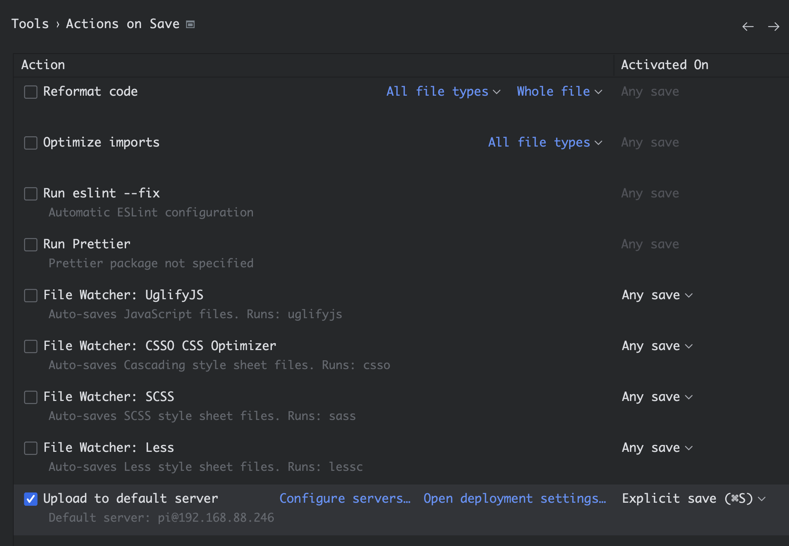
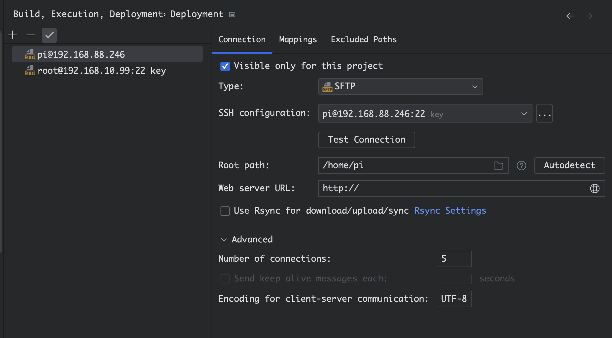
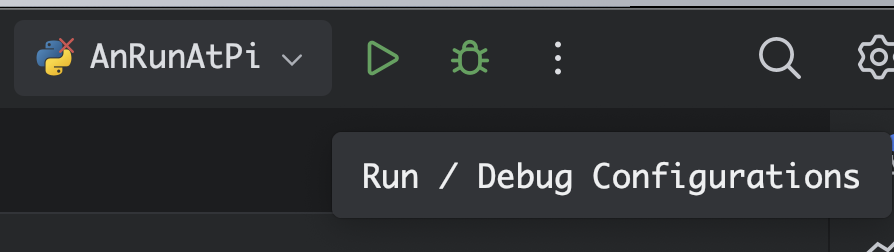
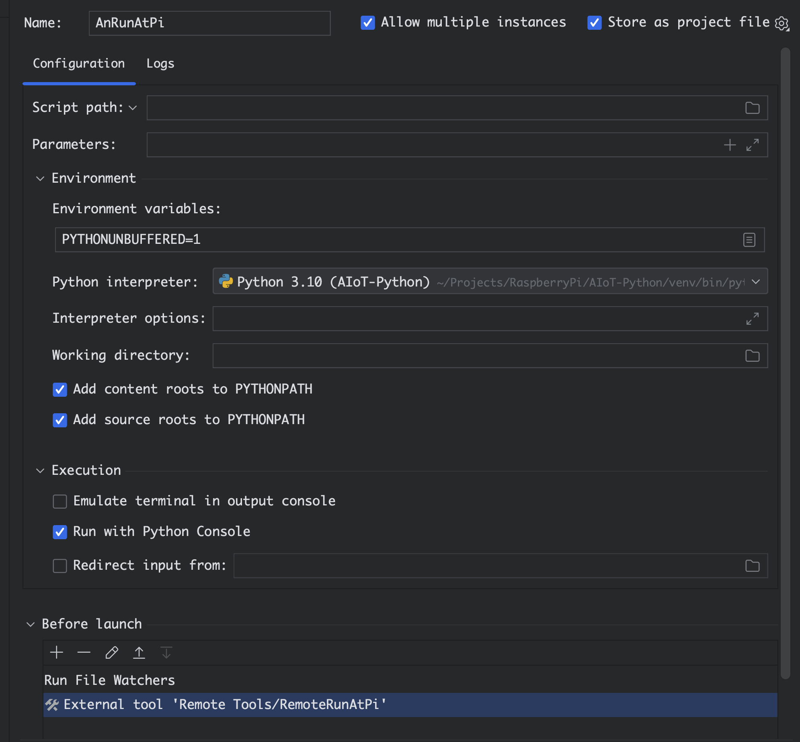
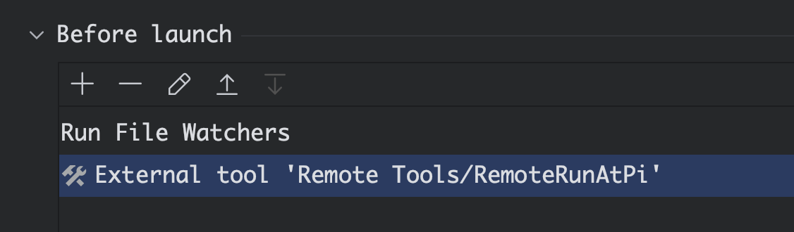
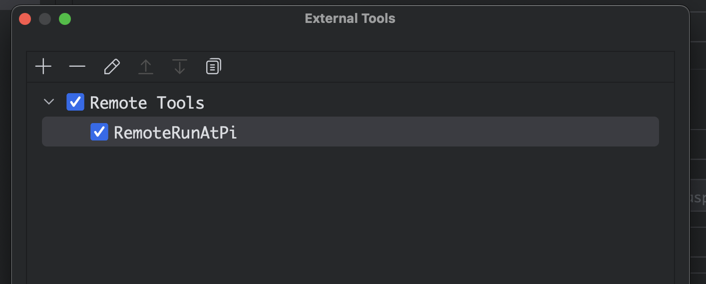
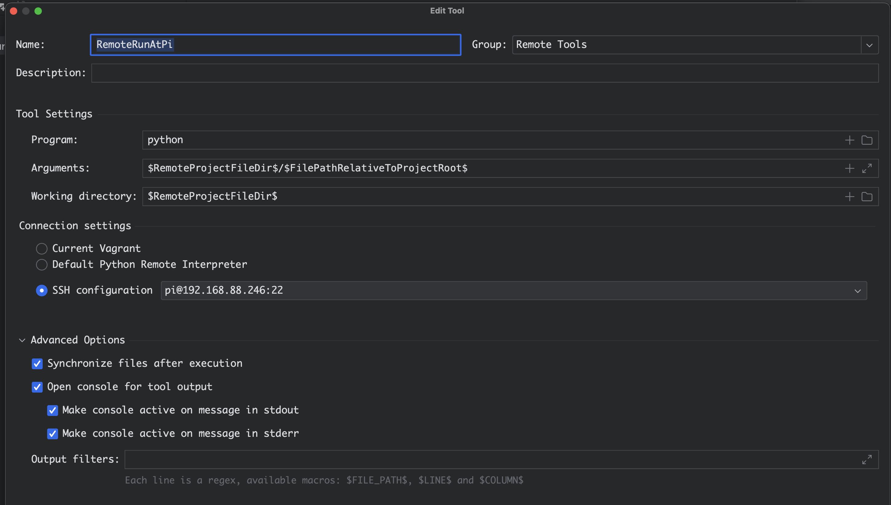

# Automation

Upload to Raspberry Pi 4B and run python file

## Actions on save

Tools > Actions on Save > Upload to default server

## Add remote server

## run/debug configuration

Add remote run

### Add **Before launch**

- Add Run File Watchers
- Add 

- 

### external tool

### Tool Settings

program: python

Arguments: $RemoteProjectFileDir$/$FilePathRelativeToProjectRoot$

Working directory: $RemoteProjectFileDir$
